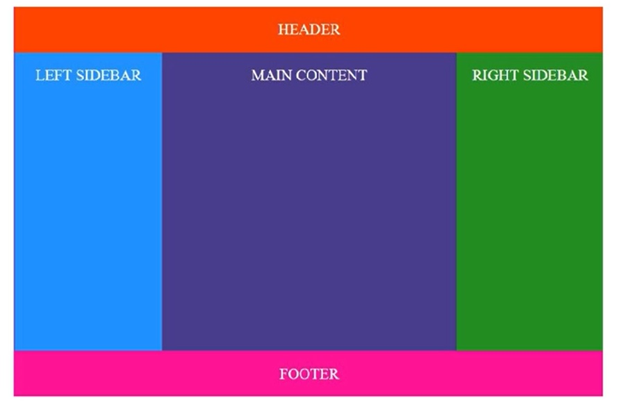
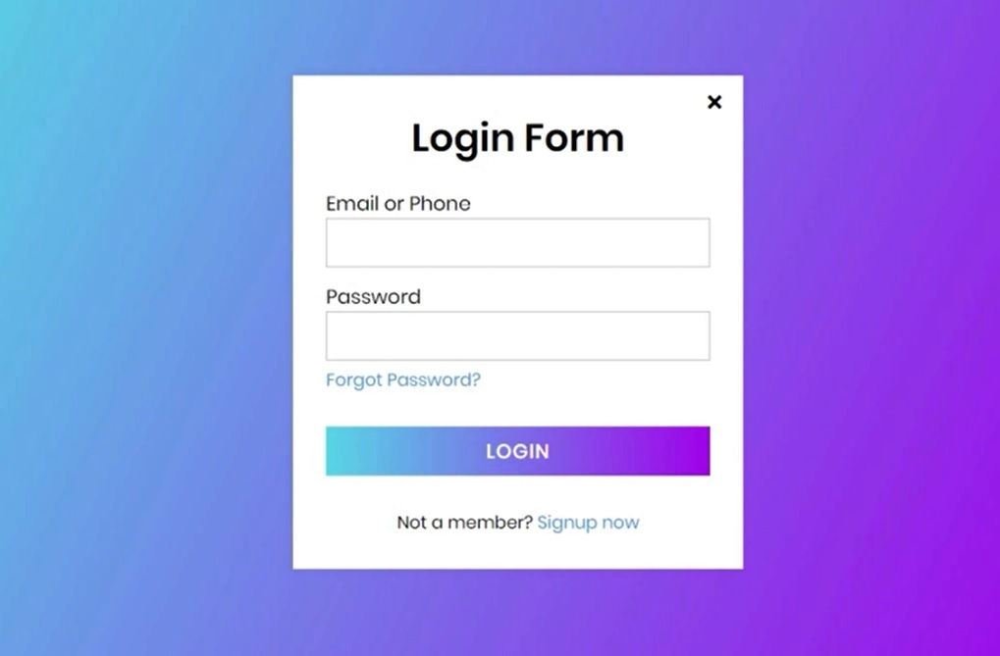

##
### Seção 4 - CSS3 Nive 2 - Conceitos Intermediarios e Avancados de CSS3
##

- Introdução do Módulo

##
### 81 - Introdução do Módulo
##

**Objetivo do módulo**

- Cobrir o máximo de conceitos intermédios de CSS3

**Algumas das matérias**

- Propriedades de texto, fonts, estilos, tipos de letra e alinhamentos.
- Borders, backgrounds com imagens, gradientes e outras propriedades
- Concentar atenção nos layouts: flow, floats e titos de posicionamento
- Organização dos layouts com **FlexBox**
- Organização dos layouts com **CSS Grid**
- Como criar **Media Queries** e muito mais

- sem projeto
- `Modelo - HTML, CSS, JS` Version 1
- Exemplo:
    - css_web-01 

##
### 82 - Explorando Propriedades de Texto
##

- Exemplo:
    - css_web-02

##
### 83 - Web Safe Fonts & Default Fonts
##

- Exemplo:
    - css_web-03

##
### 84 - Aplicando Sombras Nas Letras
##

- Exemplo:
    - css_web-04

##
### 85 - Usar Outro Tipo de Letras Com a Regra Font Face
##

- Exemplo:
    - css_web-05

##
### 86 - Utilização do Google Fonts
##

- Google Fonts
    Site: https://fonts.google.com/

- Exemplo:
    - css_web-06

##
### 87 - Duas Letras Distintas com Google Fonts
##

- titulo
- parágrafo

- Google Fonts
    - Site: https://fonts.google.com/

- Anton
    - Font: https://fonts.google.com/specimen/Anton?query=anto
- Genos
    - Font: https://fonts.google.com/specimen/Genos?query=Genos

- Exemplo:
    - css_web-07

##
### 88 - Alinhamento Horizontal
##

- Exemplo:
    - css_web-08

##
### 89 - Altura e Linha & Espaçamento Entre Letras e Palavras
##

- Exemplo:
    - css_web-09

##
### 90 - Usando o Text-Transform para Capitalização do Texto
##

- Exemplo:
    - css_web-10

##
### 91 - Font-Variant para Capitalizar Letras
##

- Exemplo:
    - css_web-11

##
### 92 - Aplicar Estilos a Listas
##

- Exemplo:
    - css_web-12

##
### 93 - Usando Backgrounds Nos Elementos HTML
##

- Exemplo:
    - css_web-13

##
### 94 - Criando Gerações de Cores
##

- Exemplo:
    - css_web-14

##
### 95 - Introdução aos Layouts de CSS
##

- Organização de layouts com **CSS**
- Organização dos elemento de HTML de acordo com alguns princípios
- Principal finalidade: **layouts responsivos**

**RESPONSIVIDADE**

- Ajustamento automático de layouts e conteúdo
- Vasto conjunto de propriedades para esta finalidade

**O CSS dispõe das seguintes áreas**

- Normal flow
- Propriedade display
- Floats
- Positioning
- Table layout
- Multiple-column layout
- Flexbox
- CSS Grid

- Exemplo:
    - css_web-15

##
### 96 - A Propriedade Display
##

- Propriedade display

- Exemplo:
    - css_web-16

##
### 97 - Floats
##

- Floats

- Exemplo:
    - css_web-17

##
### 98 - Posicionamento
##

- Positioning
- Posicionamento Relativo
- Posicionamento Absoluto

- Exemplo:
    - css_web-18

##
### 99 - Z-Index, Fixed & Sticky
##

- Exemplo:
    - css_web-19

##
### 100 - FlexBox Introdução
##

**Objetivo do FlexBox**

- Forma mais eficiente de organização do layout em CSS
- Organização dos elementos HTML no espaço
- Ajustamentos de elementos dentro de um **Container**
- Funcionalidades automáticas de responsividade
- É um modelo unidirecional

- Sem projeto
- `Modelo - HTML, CSS, JS` Version 2
- Exemplo:
    - css_web-20

##
### 101 - FlexBox Flex Container - Parte 1 de 3
##

- Exemplo:
    - css_web-21

##
### 102 - FlexBox Flex Container - Parte 2 de 3
##

- Exemplo:
    - css_web-22

##
### 103 - FlexBox Flex Container - Parte 3 de 3
##

- Exemplo:
    - css_web-23

##
### 104 - FlexBox Propriedades Dos Flex-Items
##

- Exemplo:
    - css_web-24

##
### 105 - Exercício 1 de FlexBox
##

- Exemplo:
    - css_web-24-exercicio1

##
### 106 - Exercício 2 de FlexBox
##

  

- Exemplo:
    - css_web-24-exercicio2

##
### 107 - Exercício 3 de FlexBox
##

  

- Exemplo:
    - css_web-24-exercicio3

##
### 108 - CSS Grid Introdução
##

- Introdução ao CSS Grid

**O que é o CSS Grid Layout?**

- Modelo bidimensional
- Módulo para layouts que resolve problemas antigos
- Vamos explorar conceitos e deixar de lado retro compatibilidade
- Desde Março de 2017, os browsers estão preparados
- Elemento principal: **Grid Container**
- É um dos mais poderosos módulos de CSS criados até agora

- Sem projeto
- `Modelo - HTML, CSS, JS` Version 1, e 2
- Exemplo:
    - css_web-25

##
### 109 - CSS Grid Container
##

- Exemplo:
    - css_web-26

##
### 110 - CSS Grid Template Rows & Columns
##

- Exemplo:
    - css_web-27

