##
### Seção 2 - HTML5 e CSS3 Nível 1 - Introdução ao HTML5 e CSS3
##


**Preparação do Ambiente de estudo**

- Browser
- Editor de código
- Criar pastas
- Criar ficheiros

**Browser**
- Site: https://www.google.com/intl/pt-BR/chrome/

**Editor de código**
- Site: https://code.visualstudio.com/download


<p align="center">
  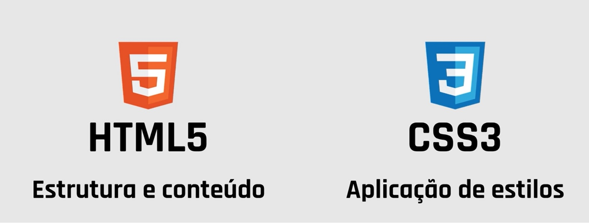
</p>


##
### HTML5
##

**H**yper **T**ext **M**arkup **L**anguage

- Não é uma linguagem de programação
- É uma linguagem de marcação
- Tags definem como apresentar o conteúdo
- Relacionado com a forma de navegação
- Serve para construir a estrutura de uma página web
- Construímos o código com elementos HTML


<p align="center">
  
</p>


**HTML** = Estrutura e conteúdo com elementos
- Todas as páginas HTML devem ter uma **estrutura base**

- Estrutura base de uma página HTML

```html
<!DOCTYPE html>
<html lang="pt-br">
<head>
	<meta charset="UTF-8">
	<meta http-equiv="X-UA-Compatible" content="IE=edge">
	<meta name="viewport" content="width=device-width, initial-scale=1.0">
	<title>Web</title>
</head>
<body>
	<!-- Conteúdo do Site -->
    
</body>
</html>
```

- VSCODE
- Criar a estrutura HTML automaticamente no visual studio code
```
! + ENTER
```

**Importante**
  
O editor de código ajuda a indentificar as tags, deves tirar vantagem na utilização dos recursos do editor
  
- Emmet Abbreviations
- Sistema de autocompletion
- Configurações, teclas de atalhos e plugins


- Resumo: Elementos HTML, Tags


<p align="center">
  
</p>

**Importante**

- O HTML não dá importância aos espaços

<p align="center">
  
</p>
  
**Importante**

- Mais do que um espaço dentro do conteúdo, é transformado num espaço só

```html
<!-- exemplo espaços em brancos são ignorados pelo interpretador -->

<p>Este parágrafo tem vários            espaços.</p>
```

<p align="center">
  
</p>

**Importante**

- Deves usar tabulações para organizar o código

<p align="center">
  
</p>


##
### 6 - Elementos para conteúdo de texto
##

**Elemento de HTML**

- HTML
```html
<!-- index.html -->

<p>Texto de um parágrafo de HTML</p>
```

```html
<!DOCKTYPE html>
<html>
  <head>
    <title>Título da página</title>
    <!-- Icones, Scripts, Metadados, Etc... -->
  </head>
  <body>
    <!-- Elemento estrutural body -->
    <h1>Título da notícia</h1>
    <h3>Sumário da notícia</h3>
    <p>Parágrafo da notícia com texto</p>
    
  </body>
</html>
```


- Elementos Normais

```html
<!-- Elementos normais -->
<h3>...</h3>
<p>...</p>
<small>...</small>
<i>...</i>
<u>...</u>
```

- Elementos Vazios

```html
<!-- Elementos vazios -->
<hr>

<br>
```

- Listas Ordenadas

```html
<!-- Listas Ordenadas -->
<ol>
  <li>...</li>
  <li>...</li>
  <li>...</li>
</ol>
```

- Listas Desordenadas

```html
<!-- Listas Desordenadas -->
<ul>
  <li>...</li>
  <li>...</li>
  <li>...</li>
</ul>
```

- `<ol>` e `<ul>` Listas ordenadas e listas desordenadas
```html
<!-- Exemplo -->

<ol>
  <li>Primeiro elemento</li>
  <li>Segundo elemento</li>
  <li>Terceiro elemento</li>
</ol>

<ul>
  <li>Primeiro elemento</li>
  <li>Segundo elemento</li>
  <li>Terceiro elemento</li>
</ul>
```

<p align="center">
  
</p>


- Links / Hiperligações

```html
<!-- Links / Hiperligações -->

<a href="www.google.com">Ir para o Google</a>
```

- Imagens

```html
<!-- Imagens -->


```


- Parágrafos

```html
<p>Parágrafo</p>
```

- Headings

```html
<!-- Heading (Título) -->
<h1>Heading 1 (Título 1)</h1>
<h2>Heading 2 (Título 2)</h2>
<h3>Heading 3 (Título 3)</h3>
<h4>Heading 4 (Título 4)</h4>
<h5>Heading 5 (Título 5)</h5>
<h6>Heading 6 (Título 6)</h6>
```

<p align="center">
  
</p>


- Um exemplo de combinação de títulos e parágrafos

```html
<!-- Um exemplo de combinação de títulos e parágrafos -->

<h1>Agência Viagens a Marte</h1>
<h3>Quem somos?</h3>
<p>Uma agência de viagens para levar qualquer um a Marte.</p>
<h3>Onde estamos?</h3>
<p>Podemos encontrar-nos no nosso site na Internet.</p>
<h3>Qual é o nosso objetivo?</h3>
<p>Proporcionar-te a melhor experiência da tua vida</p>
```

<p align="center">
  
</p>


- Quebra de linha (line break)

```html
<!-- br -->

<p>Esta é a primeira frase.</p>
<p>Esta é a segunda frase.</p>


<p>Esta é a primeira frase.<br>
E esta é a segunda frase.</p>
```

<p align="center">
  
</p>


- Separador horizontal (Horizontal rules)
```html
<!-- hr -->

<p>Primeira frase</p>
<hr>
<p>Segunda frase</p>
```

<p align="center">
  
</p>


- Contentor genérico em linhas (inline text container)
```html
<!-- span -->

<p>Esta frase <span>Contém</span> um span</p>
```

<p align="center">
  
</p>


- Outros elementos relacionados com texto

```html
<!-- text -->

<p>Texto a <strong>negrito</strong></p>
<p>Texto em <i>itálico</i></p>
<p>Texto em <em>itálico</em></p>
<p>Texto a <u>sublinhado</u></p>
<p>Texto a <s>rasurado</s></p>
<p>Texto com <q>aspas</q></p>
<p>Texto com <mark>realce</mark></p>
<p>Texto com <abbr title="Importante!">notas</abbr></p>
<p>Texto com <small>tamanho mais pequeno</small></p>
<p>A fórmula é 2mc<sup>2</sup></p>
<p>Água = H<sub>2</sub>O</p>
```

<p align="center">
  
</p>


##
### 9 - O que são atributos nos elementos HTML?
##

**O que é um atributo em HTML?**

- Todos os elementos de HTML podem conter atributos, Em alguns casos são mesmo **obrigatórios**
- São **propriedades adicionais** para configurar ou ajustar o comportamento dos elementos
- Os atributos são fundamentais na relação do HTML com o **CSS** e com o **JavaScript**
- Os atributos são definidos dentro da tag de abertura dos elementos HTML

**Exemplo**
- O elemento `a` (âncora) necessita do atributo href (Hiperlink reference)

```html
<!-- Sem Atributo -->

<a>Visitar o Goggle</a>
```

- Sem o atributo href, o browser apresenta o texto sem o aspeto de link

```html
<!-- Com o Atributo (href) -->

<a href="www.google.com.br">Visitar o Goggle</a>
```

**Atributos Globais**

- Atributos globais podem ser usados em todos os elementos HTML
- Existem atributos específicos para alguns elementos
- Atributos globais muitos comuns: `id` e `class`

- `id` identifica de forma única em elemento no documento HTML
- `class` lista de classes de um elemnto HTML


##
### 10 - ExercÍcio prático com atributos de HTML
##


- Exemplo
-  Atributos

- Atributo `target=""` com o valor `_blank` abre um link em outra página
- Atributo `alt` texto alternativo.


##
### 11 - Melhorar a estrutura do HTML com elementos semânticos
##

**O que são elementos semânticos ?**

- São elementos de HTML para agrupar outros elementos
- Não têm conteúdo
- Permitem melhorar a organização da página HTML
- Criar condições para usar o CSS da melhor forma

- Exemplo

```html
<!-- Melhorar a estrutura do HTML com elementos semânticos -->
<html lang="pt-br">
<head>
	<meta charset="UTF-8">
	<meta http-equiv="X-UA-Compatible" content="IE=edge">
	<meta name="viewport" content="width=device-width, initial-scale=1.0">
	<title>Últimas notícias</title>
</head>
<body>

    <nav>
        <a href="#">Marte é o destino do futuro</a> |
        <a href="#">Viagem de sonho</a> |
        <a href="#">Descontos para famílias</a>
    </nav>

    <article>
        <h3>Marte é o destino do futuro</h3>
        <p>
            Com a possibilidade de viajar para Marte, este planeta trasformou-se num destino de futuro.
            <br>
            Em breve, centenas de turistas irão ter a oportunidade de fazer a viagem da sua vida.
        </p>
    </article>

    <footer>
        <small><i>Agência de Notícias &copy; 2030</i></small>
    </footer>

</body>
</html>


<!--
    Autor: Daniel Oliveira
    Email: danieloliveira.webmaster@gmail.com
    Manaus/Amazonas
    12/02/2023
-->
``` 


##
### 12 - Construindo o primeiro website só com HTML
##

**Como vai ser o projeto?**

- Projeto com três páginas de HTML
- Navegação entre as páginas com hiperligações (links)
- Consolidação de conhecimentos
- Algumas dicas sobre VS Code


- *Dicas*
- `VSCode` e `Lorem ipsum`
- Gerando textos aleatórios no vscode com `Lorem ipsum`
- `lorem` + `tab`
- Gerando textos com 5 palavras
- `lorem5` + `tab`
- Gerando 7 frases aleatórias
- `lorem*7` + `tab`


**Conseguimos criar o primeiro website!**

- No entanto...
  - Aspecto visual pobre
  - Fundo branco com elementos preto?
  - Todos os elementos alinhados a esquerda!
  - Colocar duas imagens lado a lado?!


##
### CSS3
##


**C**ascading **S**tyle **S**heets

- Organização dos elementos de HTML
- Aplicação de estilos (cores, tamanhos, etc...)
- Muitos outras funcionalidades

##
### 16 - Introdução ao CSS3
##

**O que é CSS3?**

- *Cascading Style Sheets*
- Não é linguagem de programação tradicional
- É uma linguagem de definição de estilos
- `seletores` `declarações` `propriedades` `valores`

**Objetivos do CSS**

- Organização de layouts de HTML
- Definição de estilos dos elementos
- Visualização das páginas em diferentes dispositivos
- `Responsividade`


- HTML não consegue resolver tudo
- Um código HTML > Múltiplos dispositivos


<p align="center">
  
</p>

- O CSS pode ser aprendido de forma progressiva
```txt

      -> Conceitos mais avançados      ^
    -> Mais módulos de css             |
  -> Mais propriedades                 |
-> Conceitos mais básicos              |
```

##
### 17 - Três formas de aplicar estilos no HTML
##

- CSS Inline
```html
<html lang="pt-br">
<head>
	<meta charset="UTF-8">
	<meta http-equiv="X-UA-Compatible" content="IE=edge">
	<meta name="viewport" content="width=device-width, initial-scale=1.0">
    <title>Styles inline</title>
</head>
<body>
    
    <p style="color: red; font-size: 30px;">Título do meu documento</p>
    <p style="color: gray; font-size: 16px;">Lorem ipsum dolor sit amet consectetur adipisicing elit. Reprehenderit aut iure adipisci laboriosam? Quia cumque dicta quod, vero aliquam magnam debitis quidem quisquam qui quas! Doloribus facilis reiciendis fuga sit.</p>

</body>
</html>

<!--
    Autor: Daniel Oliveira
    Email: danieloliveira.webmaster@gmail.com
    Manaus/Amazonas
    12/02/2023
-->
```

- Por seletor

```html
<html lang="pt-br">
<head>
	<meta charset="UTF-8">
	<meta http-equiv="X-UA-Compatible" content="IE=edge">
	<meta name="viewport" content="width=device-width, initial-scale=1.0">
    <title>Styles seletor</title>
    <style>
        .titulo{
            color: red;
            font-size:30px;
        }
        .texto{
            color: gray;
            font-size: 16px;
        }
    </style>
</head>
<body>
    
    <p class="titulo">Título do meu documento</p>
    <p class="texto">Lorem ipsum dolor sit amet consectetur adipisicing elit. Reprehenderit aut iure adipisci laboriosam? Quia cumque dicta quod, vero aliquam magnam debitis quidem quisquam qui quas! Doloribus facilis reiciendis fuga sit.</p>

</body>
</html>


<!--
    Autor: Daniel Oliveira
    Email: danieloliveira.webmaster@gmail.com
    Manaus/Amazonas
    12/02/2023
-->
```

- Arquivo css externo
```html
<html lang="pt-br">
<head>
	<meta charset="UTF-8">
	<meta http-equiv="X-UA-Compatible" content="IE=edge">
	<meta name="viewport" content="width=device-width, initial-scale=1.0">
    <title>Styles externo</title>
    <link rel="stylesheet" href="estilos.css">
</head>
<body>
    
    <p class="titulo">Título do meu documento</p>
    <p class="texto">Lorem ipsum dolor sit amet consectetur adipisicing elit. Reprehenderit aut iure adipisci laboriosam? Quia cumque dicta quod, vero aliquam magnam debitis quidem quisquam qui quas! Doloribus facilis reiciendis fuga sit.</p>

</body>
</html>


<!--
    Autor: Daniel Oliveira
    Email: danieloliveira.webmaster@gmail.com
    Manaus/Amazonas
    12/02/2023
-->
```

- Arquivo css `styles.css` ou `estilos.ccs`
- `estilos.ccs`

```css
/* estilos.css */

.titulo{
    color: red;
    font-size:30px;
}
.texto{
    color: gray;
    font-size: 16px;
}

```

**Três formas de aplicar estilos no HTML**

- Estilos em linha (inline)
  - Aplicados através de atributos ai=o nível de cada elemento

- Utilização do elemento `<style>`
  - Aplicados ao nível de cada página

- Importação de folhas de estilos
  - Importados para as páginas, ao nível dos projetos


##
### 18 - Explorando os conceitos base do CSS3
##

**Regra de CSS (CSS rule)**

- CSS Rule

```css
/* Exemplo */

p { font-size: 18px; }
```

<p align="center">
  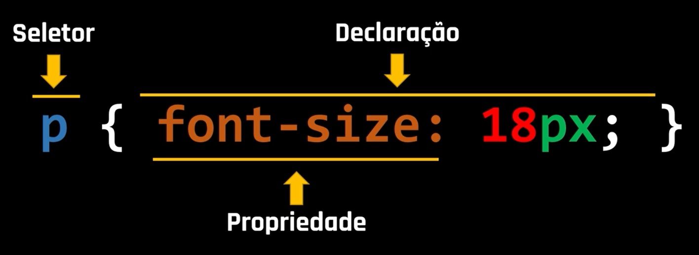
</p>

- O ponto e vírgula separa ou fecha cada par de propriedade / valor

```css
/* Exemplo */

p { font-size: 18px; color: red; }
```

<p align="center">
  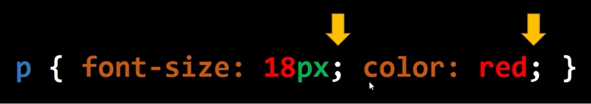
</p>


- A forma mais comum de vermos uma regra de CSS

```css
/* Exemplo */

p { 
    font-size: 18px; 
    color: red; 
  }
```

<p align="center">
  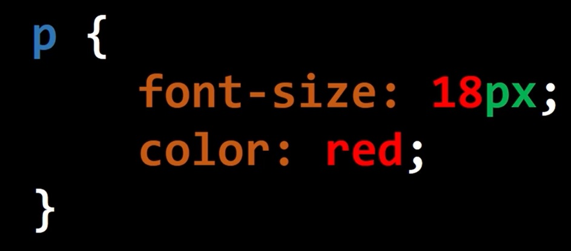
</p>


##
### 19 - Os Seletores de CSS3 na Prática - Parte 1
##

- Exemplo 
  - html_web-16

##
### 20 - Os Seletores de CSS3 na Prática - Parte 2
##

- Exemplo 
  - html_web-17


##
### 21 - Introdução as declarações de CSS
##

**Declarações de CSS**

- `Propriedades` `Valor` 
- As propriedades têm nomes facilitadores

```txt
background (fundo)  Define a cor de fundo do elemento
```

```txt
font-size (tamanho da letra)  Define o tamanho da letra do elemento
```

<p align="center">
  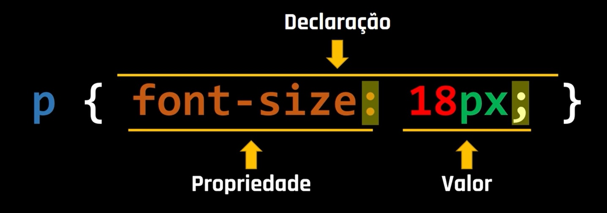
</p>


**Muito interessante:**

- O Visual Studio Code dispõe de mecanismos de de ajuda
- Permite acelerar processos e percerber que opçõess existem


##
### 22 - Duas extensões para teu Visual Studio Code
##


**Extensões**

- *VSCode*
- `CSS Formatter` Permite a formatação do codigo css
- `Live Server` Atualiza o browser em tempo real


##
### 23 - Definir cores no CSS Abordagem teórica
##

**Sistema de cores disponiveis no CSS**

- Palavras-chaves de cores
  - São cerca de 140 cores com nomes em letra minúscula

- RGB e RGBA
  - Red, Green e Blue (Alpha)

- HSL e HSLA
  - Hue, Saturation e lightness (Alpha)

- Código Hexadecimal
  - 6 ou 8 caracteres (no caso Alpha) que permitem definir as cores

- Outros ...

**Palavras-Chaves de cores**
- São cerca de 140 cores, com nomes letra minúscula, que indentificam cada cor

<p align="center">
  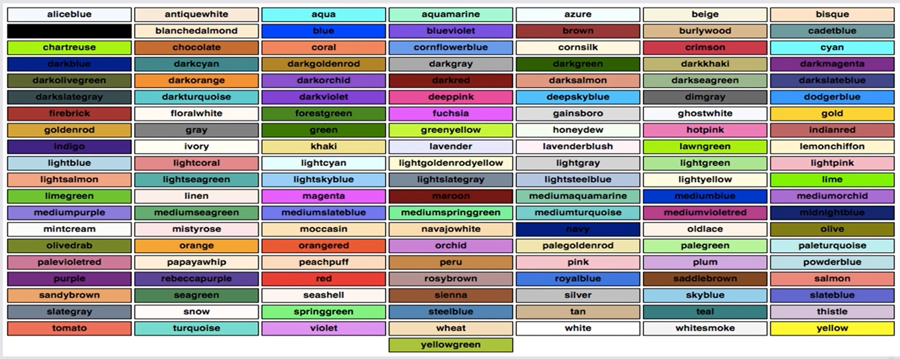
</p>


**RGB**
- **R**ed, **G**reen **B**lue
- Função que permite usar 3 parâmetros:

<p align="center">
  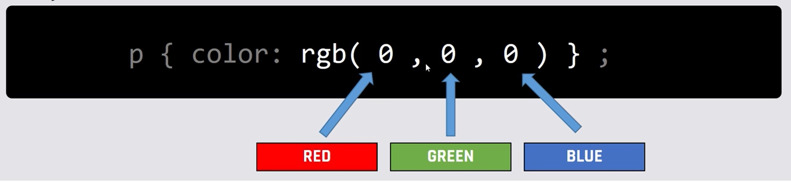
</p>

- Valores variam entre 0 e 255


**RGB**
- **R**ed, **G**reen **B**lue **A**lpha
- Permite o uso de um quarto parâmetro: `Transparência` / `Opacidade`


<p align="center">
  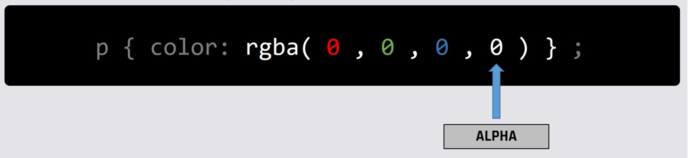
</p>

- Valores variam entre 0 e 1, com uso de números decimais


**HSL**
- **H**ue, **S**aturation **L**ightness
- Função que permite usar 3 parâmetros:

<p align="center">
  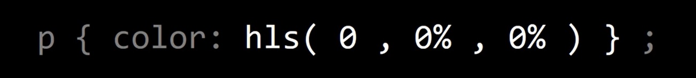
</p>

- `Tonalidade (0* a 359*)` `Saturação (0% a 100%)` `Luminosidade (0% a 100%)` 


**HUE** (Tonalidade)

<p align="center">
  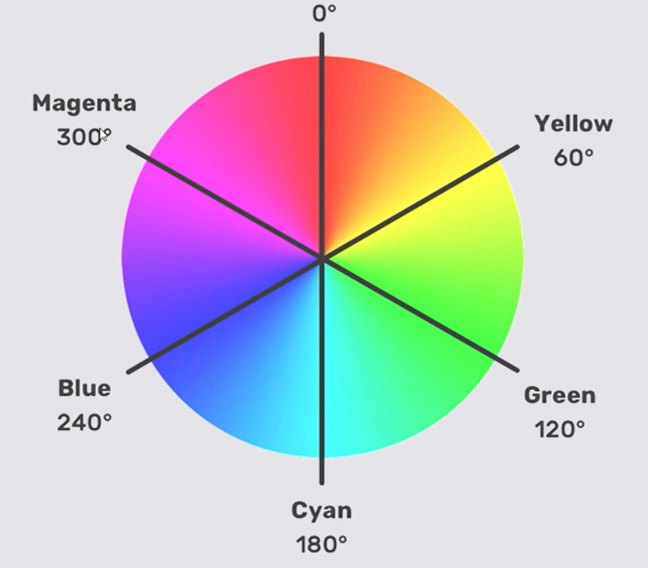
</p>


**HSLA**
- **H**ue, **S**aturation **L**ightness **A**lpha
- Função que permite usar 4 parâmetros:


<p align="center">
  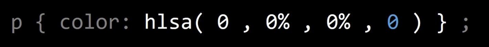
</p>


- `Tonalidade (0* a 359*)` `Saturação (0% a 100%)` `Luminosidade (0% a 100%)` `Transparência (0 a 1)`


**Código Hexadecimal**

<p align="center">
  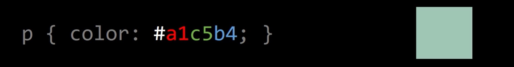
</p>


<p align="center">
  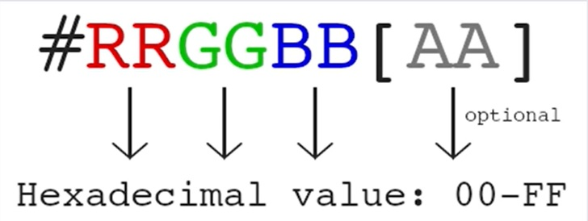
</p>

- rgb(161, 197, 180)

<p align="center">
  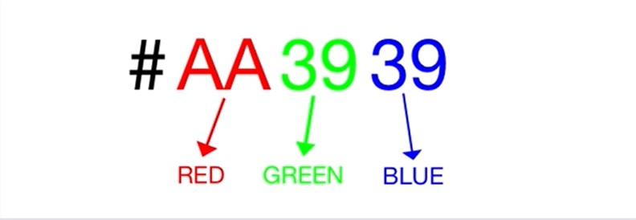
</p>

- hsl(152, 24%, 70%)


##
### 24 - Definir cores no CSS Abordagem prática
##


- Exemplo 
  - html_web-21


##
### 25 - CSS Box Model
##


- Exemplo 
  - html_web-22


<p align="center">
  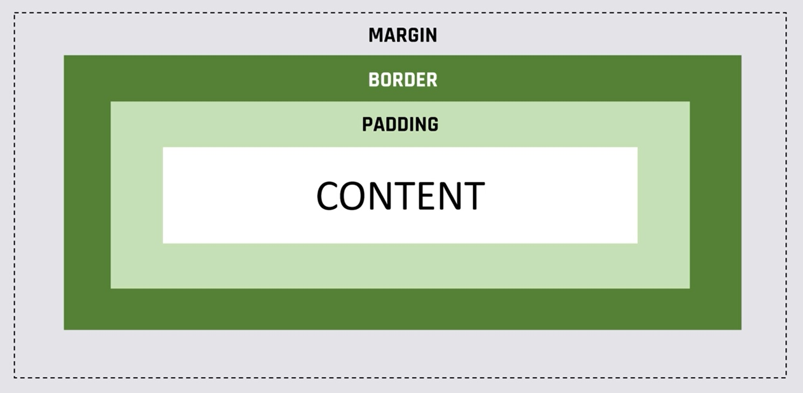
</p>

- CSS Box Model
```html
<!-- Exemplo -->

<h1>Título do artigo</h1>
```

<p align="center">
  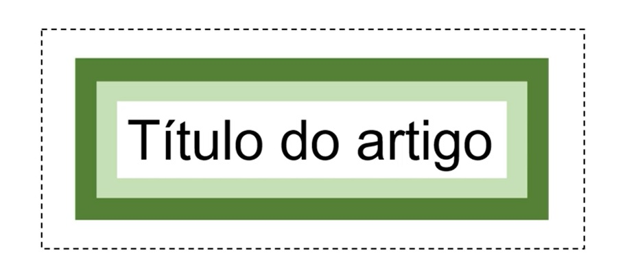
</p>


##
### 26 - Box Model nas ferramentas do programador
##

- Exemplo 
  - html_web-23


- Ferramentas do programador
- `Google Chrome`
  - `f12`
  - Ou
  - Clicar na página com botão o direto do mouse, selecionar (inspecionar)


