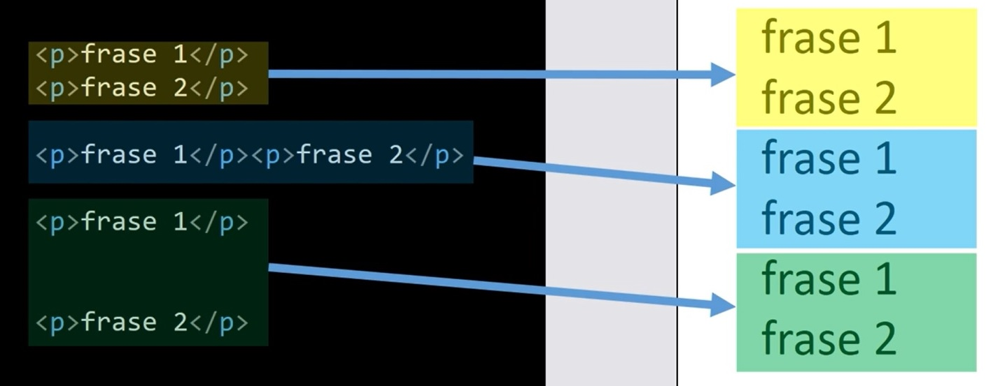
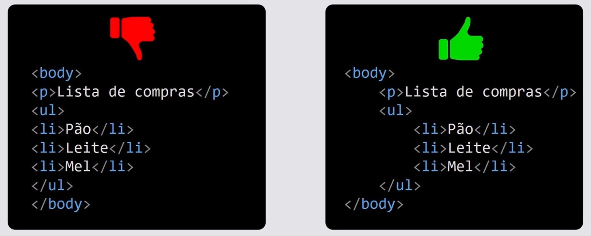

##
### Seção 2 - HTML5 CSS3 Nível 1 - Introdução ao HTML5 e CSS3
##


**Preparação do Ambiente de estudo**

- Browser
- Editor de código
- Criar pastas
- Criar ficheiros

**Browser**
- Site: https://www.google.com/intl/pt-BR/chrome/

**Editor de código**
- Site: https://code.visualstudio.com/download


<p align="center">
  
</p>


##
### HTML5
##

**H**yper **T**ext **M**arkup **L**anguage

- Não é uma linguagem de programação
- É uma linguagem de marcação
- Tags definem como apresentar o conteúdo
- Relacionado com a forma de navegação
- Serve para construir a estrutura de uma página web
- Construímos o código com elementos HTML


<p align="center">
  
</p>


**HTML** = Estrutura e conteúdo com elementos
- Todas as páginas HTML devem ter uma **estrutura base**

- Estrutura base de uma página HTML

```html
<!DOCTYPE html>
<html lang="pt-br">
<head>
	<meta charset="UTF-8">
	<meta http-equiv="X-UA-Compatible" content="IE=edge">
	<meta name="viewport" content="width=device-width, initial-scale=1.0">
	<title>Web</title>
</head>
<body>
	<!-- Conteúdo do Site -->
    
</body>
</html>
```

- VSCODE
- Criar a estrutura HTML automaticamente no visual studio code
```
! + ENTER
```

**Elemento de HTML**

- HTML
```html
<!-- index.html -->

<p>Texto de um parágrafo de HTML</p>
```

```html
<!DOCKTYPE html>
<html>
  <head>
    <title>Título da página</title>
    <!-- Icones, Scripts, Metadados, Etc... -->
  </head>
  <body>
    <!-- Elemento estrutural body -->
    <h1>Título da notícia</h1>
    <h3>Sumário da notícia</h3>
    <p>Parágrafo da notícia com texto</p>
    
  </body>
</html>
```


<p align="center">
  
</p>

- Elementos Normais

```html
<!-- Elementos normais -->
<h3>...</h3>
<p>...</p>
<small>...</small>
<i>...</i>
<u>...</u>
```

- Elementos Vazios

```html
<!-- Elementos vazios -->
<hr>

<br>
```

- Listas Ordenadas

```html
<!-- Listas Ordenadas -->
<ol>
  <li>...</li>
  <li>...</li>
  <li>...</li>
</ol>
```

- Listas Desordenadas

```html
<!-- Listas Desordenadas -->
<ul>
  <li>...</li>
  <li>...</li>
  <li>...</li>
</ul>
```

- Links / Hiperligações

```html
<!-- Links / Hiperligações -->

<a href="www.google.com">Ir para o Google</a>
```

- Imagens

```html
<!-- Imagens -->


```


<p align="center">
  
</p>

<p align="center">
  
</p>

<p align="center">
  
</p>

**Importante**

O editor de código ajuda a indentificar as tags, deves tirar vantagem na utilização dos recursos do editor

- Emmet Abbreviations
- Sistema de autocompletion
- Configurações, teclas de atalhos e plugins


### Elementos para conteúdo de texto
```html
<p>Parágrafo</p>
```

```html
<!-- Heading (Título) -->
<h1>Heading 1 (Título 1)</h1>
<h2>Heading 2 (Título 2)</h2>
<h3>Heading 3 (Título 3)</h3>
<h4>Heading 4 (Título 4)</h4>
<h5>Heading 5 (Título 5)</h5>
<h6>Heading 6 (Título 6)</h6>
```

<p align="center">
  
</p>


##
### CSS3
##


**C**ascading **S**tyle **S**heets

- Organização dos elementos de HTML
- Aplicação de estilos (cores, tamanhos, etc...)
- Muitos outras funcionalidades


##


