##
### Seção 3 - HTML5 Nivel 2 - Conceitos Intermediarios e Avançados de HTML5
##


**Requisitos para acompanhar o módulo:**

- Conclusão do módulo **HTML5 e CSS3 Nível 1**
- Ou
- Conhecimentos básicos de HTML5 e CSS3
- Conceitos mais avançados de HTML5
- Informações complementares, mais completas e detalhadas
- Vamos usar o CSS3 do módulo 1
- Menos apresentações... mais tempo no editor de código
- Recursos disponiveis na pasta do módulo 


##
### 42 - Introdução do Módulo
##

- Exemplo:
    - html_web-01

##
### 43 - Porquê o nome index.html?
##

<p align="center">
  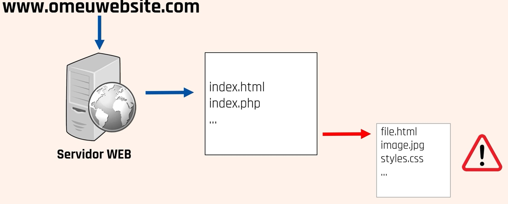
</p>

- Exemplo:
    - html_web-02


##
### 44 - Hiperligações - Exemplos mais comuns
##

**Hiperligações**

- Presença constante nas páginas web
- Criados com elementos HTML `<a>`
- Navegar entre páginas
- Navegar no conteúdo da mesma página


**Hiperligações**

<p align="center">
  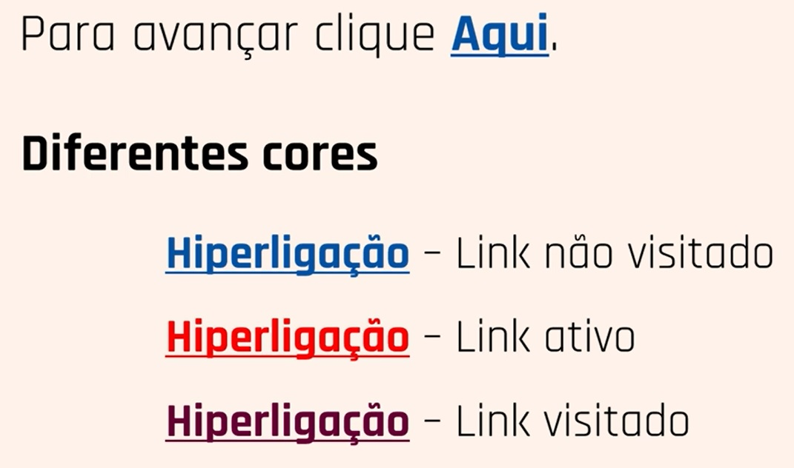
</p>


- Exemplo:
    - html_web-03


##
### 45 - Hiperligações - Target, Elementos Aninhados & Title
##

- Exemplo:
    - html_web-04


##
### 46 - Hiperligações - Download, Class & Id
##

- Exemplo:
    - html_web-05

##
### 47 - Hiperligações - Navegação com Bookmarks
##

- Exemplo:
    - html_web-06


##
### 48 - Hiperligações - Email e Chamada Telefônica
##

- Exemplo:
    - html_web-07


##
### 49 - Tabelas - Introdução as tabelas em HTML
##

**Tabelas**

- Tabela = Conjunto de células

<p align="center">
  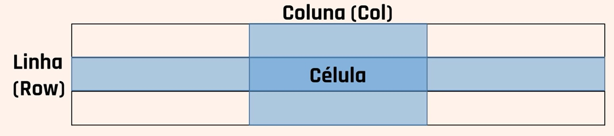
</p>

- Vários elementos e respetivos atributos para construção de tabelas
- Estruturas simples ou mais complexas
- Podem existir várias tabelas na mesma página

**IMPORTANTE**:

- As tabelas são apenas estruturas visuais sem funcionalidade associada


- Exemplo:
    - html_web-08


##
### 50 - Tabelas - Aplicar CSS as Tabelas
##

- Exemplo:
    - html_web-09


##
### 51 - Tabelas - Caption, Colspan & Rowspan
##

- Exemplo:
    - html_web-10

##
### 52 - Tabelas - Exercícios Práticos com Colspan & Rowspan
##

- Exemplo:
    - html_web-11


- Exercício 01

<p align="center">
  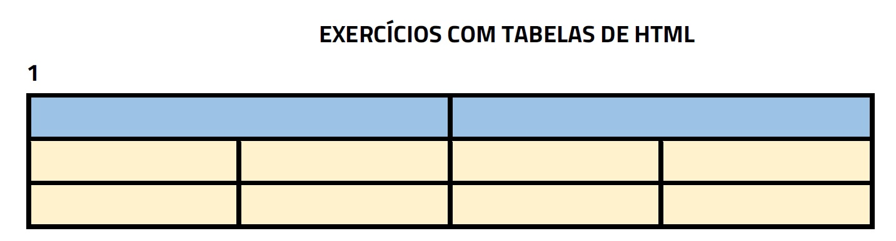
</p>

- Exercício 02

<p align="center">
  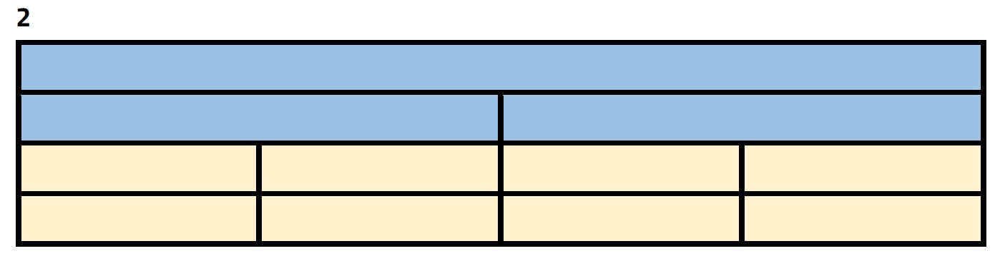
</p>

- Exercício 03

<p align="center">
  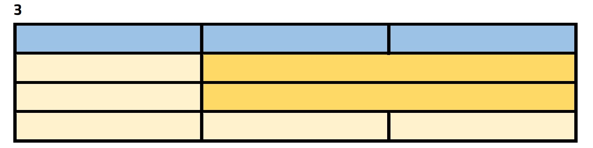
</p>

- Exercício 04

<p align="center">
  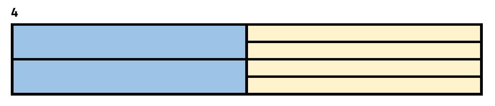
</p>

- Exercício 05

<p align="center">
  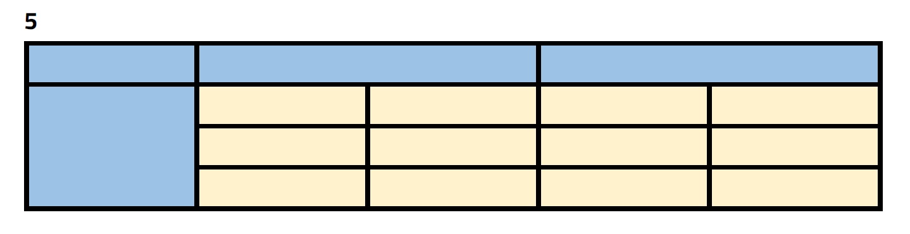
</p>

- Exercício 06

<p align="center">
  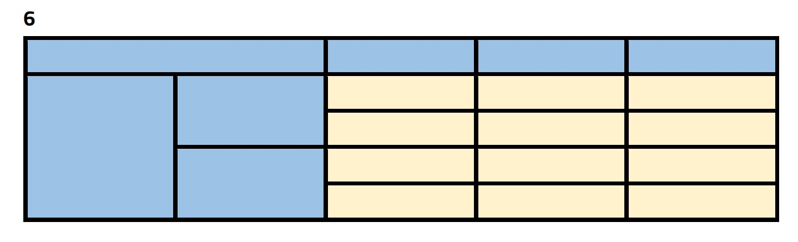
</p>


##
### 53 - Tabelas - Colgroup & Col
##

- Exemplo:
    - html_web-12


##
### 54 - Tabelas - Dimensões & Alinhamentos
##


## IMPORTANTE
===================================

- align
- bgcolor
- border
- cellpadding
- cellspacing
- frame
- rules
- summary
- width

Apenas estão disponíveis para retrocompatibilidade e não devem ser usados.
Todos os estilos devem ser aplicados via CSS.

## NOTA: Excepção para tabelas usadas em HTML para envio de emails.


- Exemplo:
    - html_web-12


##
### 55 - Dicas sobre como escrever o código HTML
##


- O HTML é muito flexível
- Usa sempre o `doctype`

```html

<!DOCTYPE html>
```

- Utiliza sempre letras minúsculas

<p align="center">
  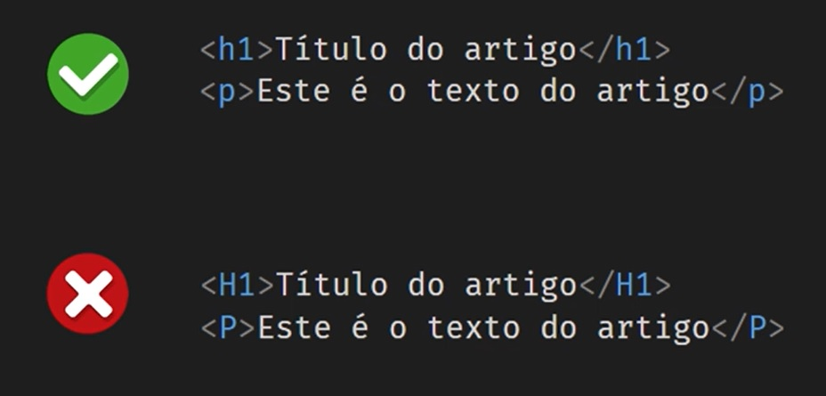
</p>


- Fechar sempre os elementos HTML

```html

<section>
    <h1>Título do artigo</h1>
    <p>
        Quem manda na minha terra sou euzis!Nullam volutpat risus nec leo commodo, ut interdum diam laoreet. Sed non consequat odio.Praesent malesuada urna nisi, quis volutpat erat hendrerit non. Nam vulputate dapibus.Não sou faixa preta cumpadi, sou preto inteiris, inteiris.       
    </p>
</section>
```

- Valores dos **Atributos**

```html

<a href="pagina.html">Link</a>
<p class="teste">
    Lorem, Ipsum dolor.
</p>

```

- Evita longas linhas de códigos

<p align="center">
  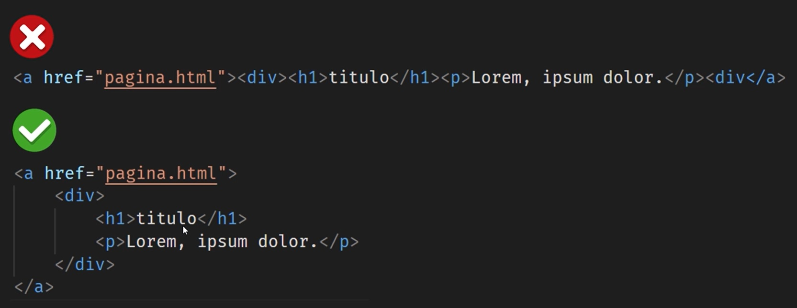
</p>


- Definir sempre o `<title>`

```html

<head>
    <title>Página Inicial</title>
</head>
```

- Fechar corretamente os **Elementos**

<p align="center">
  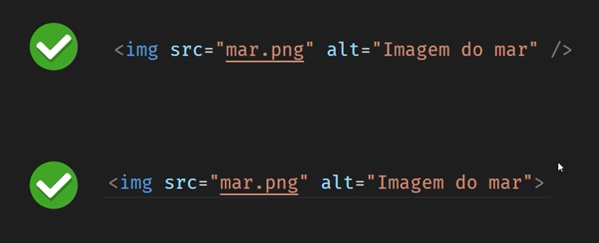
</p>


- Definir sempre o atributo lang no elemento `<html>`

```html

<html lang="pt-br">
```
- `pt-br` português do brasil


- Elementos **meta** no head da página HTML

```html

<!DOCTYPE html>
<html lang="pt-br">
<head>
	<meta charset="UTF-8">
	<meta http-equiv="X-UA-Compatible" content="IE=edge">
	<meta name="viewport" content="width=device-width, initial-scale=1.0">
	<title>Página Inicial</title>
	<link rel="stylesheet" href="css/style.css">
	<link rel="shortcut icon" href="img/favicon.ico"/>
</head>
<body>
	
	<script src="js/script.js"></script>
</body>
</html>

<!--
    Autor: Daniel Oliveira
    Email: danieloliveira.webmaster@gmail.com
    Manaus/Amazonas
    17/02/2023
-->
```

- meta charset="UTF-8" (Caracteres especias ~ ç ´ ^ )


- No project

- Exemplo:
    - html_web-14


##
### 56 - Comentários em HTML
##

- HTML
```html

<!-- Comentários em uma única linha em HTML -->


<!-- 
    Comentários de multiplas linhas em HTML 
-->
```

- CSS
```css

// Comentário de uma única linha
/* Comentários de multiplas linhas em CSS */
```

- Os comentários têm duas finalidades fundamentais
- 1* Documentar o código, para tornar sua leitura mais fácil 
- 2* Possibilidade de desativar certas funcionalidades do código sem eliminá-las

- Exemplo:
    - html_web-15


##
### 57 - HTML Entities & Symbols
##

- HTML Symbols
    - Site: https://www.w3schools.com/html/html_symbols.asp
    - Site: https://www.toptal.com/designers/htmlarrows/symbols/
    - Site: https://www.dofactory.com/html/charset/symbols
    - Site: https://www.htmlsymbols.xyz/
    - Site: https://www.rapidtables.com/web/html/html-codes.html
    - Site: http://cactus.io/resources/toolbox/html-symbol-codes
    - Site: http://arquivo.devmedia.com.br/artigos/devmedia/html-entities.html
    - Site: https://www.thoughtco.com/html-code-for-common-symbols-and-signs-2654021
    - Site: https://ascii.cl/htmlcodes.htm


- Corretor Ortográfico
    - Site: https://languagetool.org/pt-BR

- Exemplo:
    - html_web-16


##
### 58 - Formulários - Introdução
##

**Como funciona um formulário de HTML?**

<p align="center">
  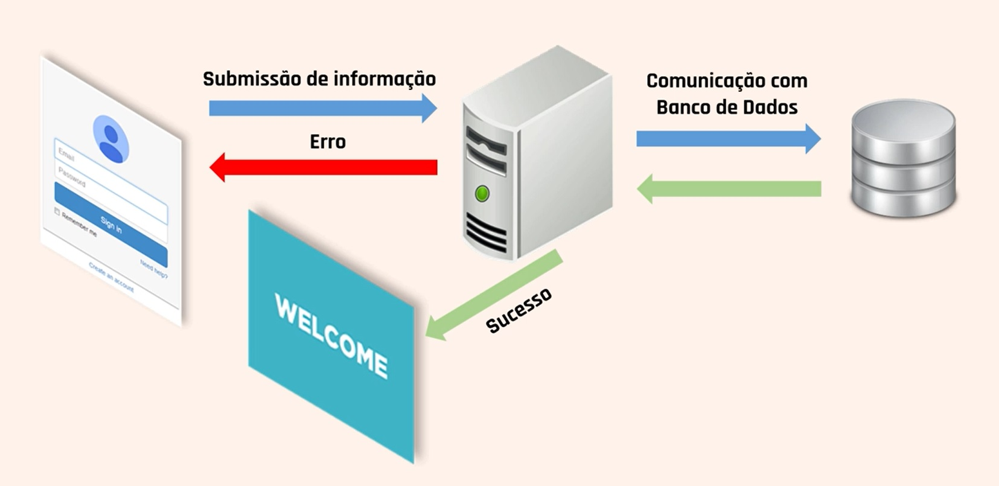
</p>

- Como funciona um formulário de HTML?
- Conjunto de elementos para preenchimento
- Submissão do formulário para servidor web
- Tratamento da informação
- Resposta do servidor face aos dados enviados

**IMPORTANT**

- Endereço de internet para tratamento dos dados
    - https://www.sys4soft.com/udemy/forms/index.php


- Sem projeto

- Exemplo:
    - html_web-17


##
### 59 - Formulários - O teu Primeiro Formulário
##


- Exemplo:
    - html_web-18